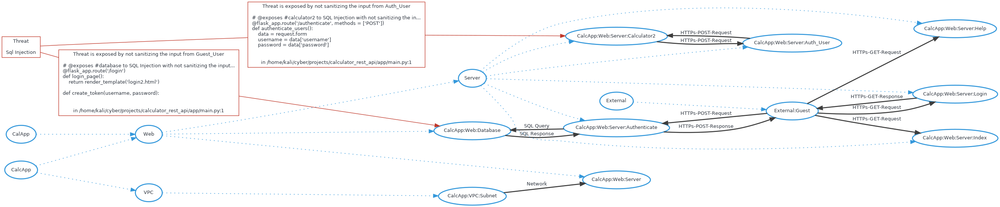

# Threatspec Project Threat Model

A threatspec project.


# Diagram



# Exposures

## Sql injection against CalcApp:Web:Database
Not sanitizing the input from guest_user

```
# @exposes #database to SQL Injection with not sanitizing the input from Guest_User
@flask_app.route('/login')
def login_page():
    return render_template('login2.html')

def create_token(username, password):

```
/home/kali/cyber/projects/calculator_rest_api/app/main.py:1

## Sql injection against CalcApp:Web:Server:Calculator2
Not sanitizing the input from auth_user

```
# @exposes #calculator2 to SQL Injection with not sanitizing the input from Auth_User
@flask_app.route('/authenticate', methods = ['POST'])
def authenticate_users():
    data = request.form
    username = data['username']
    password = data['password']

```
/home/kali/cyber/projects/calculator_rest_api/app/main.py:1


# Acceptances


# Transfers


# Mitigations


# Reviews


# Connections

## External:Guest To CalcApp:Web:Server:Index
HTTPs-GET-Request

```
# @connects #guest to #index with HTTPs-GET-Request
@flask_app.route('/')
def index_page():
    print(request.headers)
    isUserLoggedIn = False
    if 'token' in request.cookies:

```
/home/kali/cyber/projects/calculator_rest_api/app/main.py:1

## External:Guest To CalcApp:Web:Server:Help
HTTPs-GET-Request

```
# @connects #guest to #help with HTTPs-GET-Request
@flask_app.route('/help')
def help_page():
    return "This is the help page"


```
/home/kali/cyber/projects/calculator_rest_api/app/main.py:1

## External:Guest To CalcApp:Web:Server:Login
HTTPs-GET-Request

```
# @connects #guest to #login with HTTPs-GET-Request

@flask_app.route('/login')
def login_page():
    return render_template('login2.html')


```
/home/kali/cyber/projects/calculator_rest_api/app/main.py:1

## CalcApp:Web:Server:Login To External:Guest
HTTPs-GET-Response

```
# @connects #login to #guest with HTTPs-GET-Response

@flask_app.route('/login')
def login_page():
    return render_template('login2.html')


```
/home/kali/cyber/projects/calculator_rest_api/app/main.py:1

## External:Guest To CalcApp:Web:Server:Authenticate
HTTPs-POST-Request

```
# @connects #guest to #authenticate with HTTPs-POST-Request

@flask_app.route('/login')
def login_page():
    return render_template('login2.html')


```
/home/kali/cyber/projects/calculator_rest_api/app/main.py:1

## CalcApp:Web:Server:Authenticate To External:Guest
HTTPs-POST-Response

```
# @connects #authenticate to #guest with HTTPs-POST-Response

@flask_app.route('/login')
def login_page():
    return render_template('login2.html')


```
/home/kali/cyber/projects/calculator_rest_api/app/main.py:1

## CalcApp:Web:Server:Authenticate To CalcApp:Web:Database
SQL Query

```
# @connects #authenticate to #database with SQL Query

@flask_app.route('/authenticate', methods = ['POST'])
def authenticate_users():
    data = request.form
    username = data['username']

```
/home/kali/cyber/projects/calculator_rest_api/app/main.py:1

## CalcApp:Web:Database To CalcApp:Web:Server:Authenticate
SQL Response

```
# @connects #database to #authenticate with SQL Response

@flask_app.route('/authenticate', methods = ['POST'])
def authenticate_users():
    data = request.form
    username = data['username']

```
/home/kali/cyber/projects/calculator_rest_api/app/main.py:1

## CalcApp:Web:Server:Auth_User To CalcApp:Web:Server:Calculator2
HTTPs-POST-Request

```
# @connects #auth_user to #calculator2 with HTTPs-POST-Request
@flask_app.route('/calculator2', methods = ['GET'])
def calculator_get():
    isUserLoggedIn = False
    if 'token' in request.cookies:
        isUserLoggedIn = verify_token(request.cookies['token'])

```
/home/kali/cyber/projects/calculator_rest_api/app/main.py:1

## CalcApp:Web:Server:Calculator2 To CalcApp:Web:Server:Auth_User
HTTPs-POST-Request

```
# @connects #calculator2 to #auth_user with HTTPs-POST-Request
@flask_app.route('/calculator2', methods = ['GET'])
def calculator_get():
    isUserLoggedIn = False
    if 'token' in request.cookies:
        isUserLoggedIn = verify_token(request.cookies['token'])

```
/home/kali/cyber/projects/calculator_rest_api/app/main.py:1

## CalcApp:VPC:Subnet To CalcApp:Web:Server
Network

```
# @connects #subnet to #web_server with Network
resource "aws_instance" "cyber94_calculator2_mohammed_app_server_tf" {
  ami = "ami-0943382e114f188e8"
  instance_type = "t2.micro"
  key_name = "cyber94-mali"


```
/home/kali/cyber/projects/calculator_rest_api/terraform-infra/main.tf:1


# Components

## CalcApp:Web:Database

## CalcApp:Web:Server:Calculator2

## External:Guest

## CalcApp:Web:Server:Index

## CalcApp:Web:Server:Help

## CalcApp:Web:Server:Login

## CalcApp:Web:Server:Authenticate

## CalcApp:Web:Server:Auth_User

## CalcApp:VPC:Subnet

## CalcApp:Web:Server


# Threats

## Sql injection


# Controls
